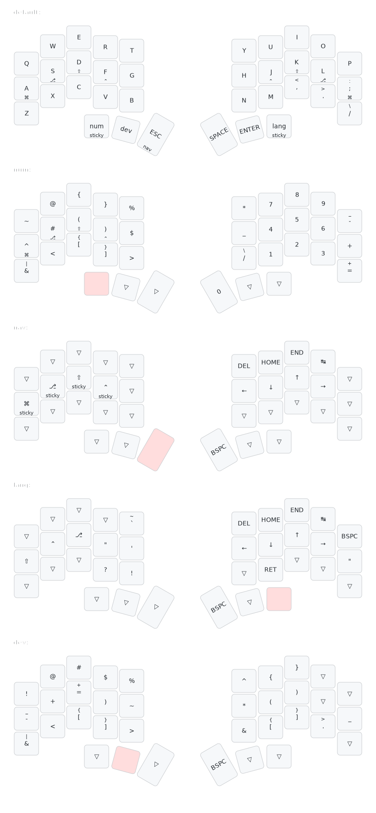

# Temper ZMK Config

This is my personal ZMK config for the [temper](https://github.com/raeedcho/temper).

Some notes about this config:
- Default layer is QWERTY with home row mods [GASC](https://precondition.github.io/home-row-mods#gasc)
- Navigation layer has vim-like arrow keys

